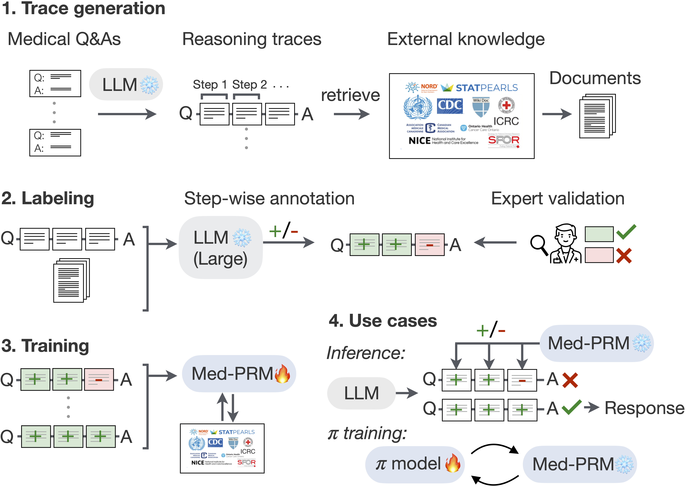

<p align="center">
  
</p>

# Med-PRM: Medical Reasoning Models with Step-wise Guideline-verified Process Rewards


<p align="center">
    <a href="https://arxiv.org/pdf/"></a>
    <a href="https://med-prm.github.io/"></a>
    <a href="https://github.com/eth-medical-ai-lab/Med-PRM"></a>
    <a href="https://med-prm.github.io/#citation-ref"></a>
    <a href="https://huggingface.co/dmis-lab/llama-3.1-medprm-reward-v1.0"></a>
</p>


### News

* [June/16/2025] 📰 **Med-PRM** preprint is now available on [arXiv](https://arxiv.org/pdf/).
* [May/19/2025] 📈 **Med-PRM** is the first 8B framework to achieve over 80% accuracy on MedQA.
* [May/19/2025] 🎉 🎊 🎉 We are thrilled to announce the first launch of **Med-PRM**, a medical process reward model first to augment retrieval.


## 📖 Overview

- **MED-PRM** is a novel framework designed to enhance clinical decision-making by addressing errors in the reasoning process. It leverages retrieval-augmented generation (RAG) to verify each reasoning step against established medical knowledge bases, ensuring accuracy and reliability in medical diagnoses. MED-PRM is not intended to replace the expertise of healthcare professionals but to augment it, allowing them to focus on critical thinking and patient care while automating the verification of reasoning steps.

<p align="center">
  
</p>


## Scoreboard

| Policy Model       | Reward Model       | Policy Base Model | Reward Base Model | Policy Training Method | Reward Training Method | MedQA-4 |
|--------------------|--------------------|-------------------|-------------------|------------------------|------------------------|---------|
| Med PRM Policy v1.0 | Med PRM Reward v1.0 | Llama 3.1 8B IT | Llama 3.1 8B IT | Rejection Sampling | SFT | 79.18 |
| Llama-3.1-8B-UltraMedical | Med PRM Reward v1.0 | Llama 3.0 8B IT | Llama 3.1 8B IT | SFT | SFT | 79.87 |
| llama-3-meerkat-8b-v1.0 | Med PRM Reward v1.0 | Llama 3.0 8B IT | Llama 3.1 8B IT | SFT | SFT | 80.35 |

## 🖥️ Installation

1. **Prepare Data**: Execute the data preparation script:

   ```bash
   python python/0_preparing.py
   ```

2. **Score with PRM**: Run a quick test for Med-PRM:

   ```bash
   bash scripts/4_scoring_PRM.sh
   ```

3. **Train the Model**: If desired, train the model (data already downloaded in step 5):

   ```bash
   bash scripts/2_training.sh
   ```


### Contact
Feel free to reach out to jhyun0414@hanyang.ac.kr or jisohn@ethz.ch


**BibTeX Citation**: If you use Med-PRM in your research, please cite it using the following BibTeX entry:

   ```bibtex
   @misc{medprm2025,
     title={Med-PRM: Medical Reasoning Models with Step-wise Guideline-verified Process Rewards},
     author={Jaehoon Yun and Jiwoong Sohn and Jungwoo Park and Hyunjae Kim and Xiangru Tang and Daniel Shao and Yong Hoe Koo and Ko Minhyeok and Qingyu Chen and Mark Gerstein and Michael Moor and Jaewoo Kang},
     year={2025},
     month={May},
     url={}
   }
   ```

